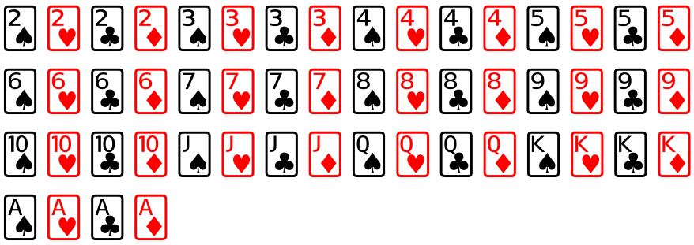
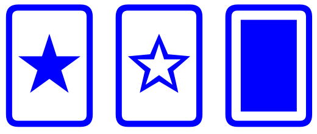

<!-- README.md is generated from README.Rmd. Please edit that file -->
suitr 
============================================================

[](https://codecov.io/github/GregorDeCillia/suitr?branch=master) [](https://travis-ci.org/GregorDeCillia/suitr)

This package makes it easy to create cards in R either for printing in the console or for html export. The logic is based aroud the unicode representation of cards (and other objects) which are wrapped in a span container.

Installation
------------

You can install suitr from github via `install_github()`

``` r
devtools::install_github("GregorDeCillia/suitr")
```

Cards
-----

Cards are always represented by strings like `"Kc"` or `"7s"`. They can be converted into HTML via `card_html()`.

``` r
library(suitr)
span(card_html("Jh"), card_html("As"), card_html("Tc"), card_html("2d"))
```


`card_unicode()` converts cards into a unicode representation which means they can be printed directly into the console.

``` r
cat(card_unicode("Ad"))
#> 🃁
```

suitr uses a four color deck by default. This behavior can be changed with the parameter `fourColor`.

``` r
card_list()
#>  [1] "2s" "2h" "2c" "2d" "3s" "3h" "3c" "3d" "4s" "4h" "4c" "4d" "5s" "5h"
#> [15] "5c" "5d" "6s" "6h" "6c" "6d" "7s" "7h" "7c" "7d" "8s" "8h" "8c" "8d"
#> [29] "9s" "9h" "9c" "9d" "Ts" "Th" "Tc" "Td" "Js" "Jh" "Jc" "Jd" "Qs" "Qh"
#> [43] "Qc" "Qd" "Ks" "Kh" "Kc" "Kd" "As" "Ah" "Ac" "Ad"
```

``` r
card_list() %>% lapply(card_html, size = 50) %>% span()
```


``` r
card_list() %>% lapply(card_html, size = 50, fourColor = FALSE) %>% span()
```



Suits
-----

It is also possible to get the unicode representation of the suits symbols and export them into html.

``` r
suit_list()
#> [1] "s" "h" "c" "d"
```

``` r
suit_list() %>% lapply(suit_html) %>% span()
```


``` r
suit_list() %>% lapply(suit_html, fill = FALSE) %>% span()
```


``` r
suit_list() %>% sapply(suit_unicode) %>% cat()
#> ♠ ♥ ♣ ♦
```

Special cards
-------------

Tere are currently 3 "special" cards implemented which do not match the rank-suit pattern of the cards above. Those are wrapped into a named list which can be obtained with `card_specials()`.

``` r
names(card_specials())
card_specials() %>% lapply(unicode_html, style = "color: blue;") %>% span()
```



Dice
----

``` r
1:6 %>% lapply(dice_html, size = 140) %>% span()
```


Chess
-----

``` r
pieces_list()
#> [1] "k" "q" "r" "b" "n" "p"
```

``` r
pieces_list() %>% lapply(chess_html, size = 140) %>% span()
```


``` r
pieces_list() %>% lapply(chess_html, color = "black", size = 140) %>% span()
```


Mahjong
-------

``` r
mahjong_list()[1:4]
#> [1] "east wind"  "south wind" "west wind"  "north wind"
```

``` r
mahjong_list() %>% lapply(mahjong_html, size = 68) %>% span()
```


Domino
------

``` r
span(domino_html(4, 5), domino_html(0, 6), domino_html(6, 2, horizontal = FALSE))
```


Draughts
--------

``` r
span(draughts_html("white", "man"), draughts_html("white", "king"),
     draughts_html("black", "man"), draughts_html("black", "king")) %>% browsable()
```

<!--html_preserve-->
<span> <span style="font-size: 172px;">⛀</span> <span style="font-size: 172px;">⛁</span> <span style="font-size: 172px;">⛂</span> <span style="font-size: 172px;">⛃</span> </span><!--/html_preserve-->
